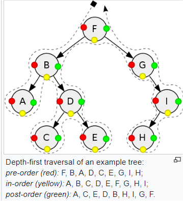

# Zkouška

## Přednáška 1  Časová složitost

### Algoritmus

intuitivní pojem, není pro něj specifikcká definice
možnou definicí by mohlo být
- Konečná posloupnost elementárních příkazů, jejichž provádění
umožňuje pro každá přípustná vstupní data mechanickým způsobem
získat po konečném počtu kroků příslušná výstupní data

Typické vlastnosti:
- konečnost
- hromadnost
- resultativnost
- jednoznačnost
- determinismus

### Největší společný dělitel:

NSD(x,y), od 1 do min(x,y)
- zkoušet od min(x,y) dolů do nalezení prvního společného dělitele
- nalézt prvočíselné rozklady x,y, maximální společná část je pak NSD(x,y
- Euklidův algoritmus:
  - x < y --> NSD(x,y) = NSD(x,y-x)
  - x > y --> NSD(x,y) = NSD(x-y,y)
  - x = y --> NSD(x,y) = x
```python
while y > 0:
  z = x % y
  x = y
  y = z
print(x)
```

### Efektivita algoritmu:

časová - rychlost výpočtu programu

prostorová(paměťová) - paměť potřebná na uložení dat při výpočtu programu

optimalizujeme zpravidla jen jedno, protože obě kritéria mohou mířit proti sobě
"výměna času za paměť"

### Funkce:

počet vykonaných operací v závislosti na velikosti vstupních dat
funkce časové i prostorové složitosti většinou rostoucí

### Asymptotická časová složitost:

Symbol velké O, odhad shora
f, g: N → R
f ∈ O(g) <=> E c > 0 V n0 > 0 V n ≥ n0 : 0 ≤ f(n) ≤ c.g(n)

Opačný odhad zdola: f ∈ Ω(g) 0 ≤ c.g(n) ≤ f(n)

Přesný (těsný) odhad: f ∈ Θ(g) <=> f ∈ O(g) a f ∈ Ω(g)

Typické třídy asymptotické složitosti jsou
- O(1)
- O(log N)
- O(N)
- O(N log N)
- O(N<sup>2</sup>)
- O(N<sup>x</sup>)
- O(2<sup>N</sup>)
- O(N!)

polynomiálně omezený čas zvládnutelný i pro velká n, exponenciální časově nezvládnutelný
## Přednáška 2  Základní algoritmy

### Složitost algoritmu v různých příkladech:

Pro každá vstupní data velikosti N nemusí trvat výpočet stejně dlouho

Časová složitost algoritmu v
- nejhorším případě: maximální počet vykonaných operací
- nejlepším případě: minimální počet vykonaných operací
- průměrném případě: očekávaný počet vykonaných operací

nejčastěji se používá časová složitost v nejhorším případě

v průměrném případě se dobře charakterizuje kvalita algoritmu, ale je obtížně oddůvoditelná

### Složitost problému:

- složitost nejlepšího algoritmu (z hlediska časové složitosti),
kterým lze řešit daný problém

odvození bývá často obtížné, pro řadu problémů je složitost neznámá

Pro dokazování nejhoršího případu potřebujeme
- existuje algoritmus, který vyřeší problém v dané časové složitosti v nejhorším případě, předvedeme konkrétní algoritmus
- každý algoritmus řešící daný problém pracuje v dané časové složitosti v nejhorším příkladě, bývá složité na dokázání

Příklad

Nalézt maximum z N čísel
- existuje algoritmus v čase O(N)
- nemůže existovat algoritmus s lepší časovou obtížností, protože musíme projít všech N čísel

### Základní algoritmy s čísly:

#### Rozklad čísla na cifry
```python
def ciferny_soucet(x):
y = 0
while x != 0:
  y += x % 10
  x //= 10
return y
```
#### Test prvočíselnosti 

- zkusit všechny dělitele od 2 do N-1, cca O(N)
- zkusit všechny dělitele od 2 do $\frac{N}{2}$, cca O(N) ale lepší
- zkusit všechny dělitele od 2 do $\sqrt{N}$, cca O($\sqrt{N}$)
- zkusit dělitele od 2 do $\sqrt{N}$ do nalezení prvního
  - v nejhoším O($\sqrt{N}$)
  - v nejlepším 1
- zkusit 2 a poté liché dělitele lichých čísel
```python
from math import sqrt

def prvocislo(n):
  for d in range(2, int(sqrt(n) + 1):
    if n % d == 0:
      return False
  return True
```
nebo 
```python
def prvocislo(n):
  if n % 2 == 0: 
    return n == 2  #jediné sudé prvočíslo
  d = 3
  while d * d <= n:
      if n % d == 0:
        return False
      d += 2
  return True
```

#### Eratosthenovo síto 

Určete všechna prvočísla od 2 do N

princip - v řadě od 2 do N postupně škrtáme všechny násobky jednotlivých prvočísel, zbývající čísla pak jsou hledaná prvočísla 
```python
def eratosth(n):
  sito = [False, False] + [True] * (n-1)
  prvocisla = []

  for i in range(n + 1):
    if sito[i]:
      prvocisla.append(i)
      j = i * i         #staci zacit s nasobky od kvadratu
      while j <= n:
        sito[j] = False
        j = j + i
  return prvocisla
```
časová složitost je O($\frac{N}{2}$ + $\frac{N}{3}$ + $\frac{N}{5}$ + ...) = O(N log(log N))

#### Dlouhá čísla 

počítání s čísly s desítkami nebo stovkami cifer
python to umí sám

reprezentace
- vytvoříme seznam cifer
- použijeme seznam čísel nikoli znaků
- pořadí cifer zvolíme odpředu nebo odzadu

operace
- po cifrách sčítání, odčítání, násobení, dělení
- počítání modulo 10

desetinné číslo, ukládáme pozici desetinné čárky
- speciální hodnota uložená v seznamu (nešikovné)
- proměnná s indexem nulového řádu
- použít dvě pole (celá a desetinná část)

Příklad

Součet dvou kladných celých čísel s mnoha ciframi
Vstup: a,b jsou seznamy cifer sčítaných čísel, a[0] = cifra v řádu jednotek
Výstup: c je výsledný seznam cifer součtu čísel a + b

- sčítání s přenosem v rozsahu cifer kratšího čísla
- ošetřit přečnívající část delšího čísla
- přidat případný poslední nenulový přenos

při dělání přes spojové listy (LSS) nejsme omezeni počtem cifer, nutno otáčet seznam
```python
if len(a) < len(b)
  a, b = b, a

prenos = 0
c = []
for i in range(len(b)):
  x = a[i] + b[i] + prenos
  c.append(x%10)
  prenos = x // 10

for i in range(len(b), len(a)):
  x = a[i] + prenos
  c.append(x%10)
    prenos = x // 10

if prenos > 0:
  c.append(prenos)
```

#### Vyhodnocení polynomu v bodě 

a(x) = a<sub>n</sub>x<sup>n</sup> + a<sub>n-1</sub>x<sup>n-1</sup> ... + a<sub>1</sub>x + a<sub>0</sub>
- n stupeň polynomu
- a<sub>0</sub>, ...,a<sub>n</sub> koeficienty (reálné konstanty)
- x proměnná, dosazujeme různé hodnoty

Přímý výpočet podle předpisu 

- počet násobení: n + (n-1) + (n-2) + ... + 1 = $\frac{n(n+1)}{2}$
- počet sčítání: n
- časová složitost: Θ(n<sup>2</sup>)

Hornerovo schéma

a(x) = (...((a<sub>n</sub>x + a<sub>n-1</sub>)x + a<sub>n-2</sub>)x + ... + a<sub>1</sub>)x + a<sub>0</sub>
  - počet násobení: n
  - počet sčítání: n
  - časová složitost: Θ(n)
```python
def horner(a, x):
# a: seznam s koeficienty polynomu a[i] * x^i, x: bod z Df, vrátí hodnotu v bodě x
  h = 0
  for i in range(len(a)-1, -1, -1):
    h = h * x + a[i]
  return h
```
Příklady použití jsou vstup čísla po znacích nebo konverze číselného str na int

pomocí LSS, v každém uzlu uložen koeficient a exponent jednoho členu, vyhodné mít ho uspořádaný
#### Operace s polynomy 

a(x) = a<sub>n</sub>x<sup>n</sup> + a<sub>n-1</sub>x<sup>n-1</sup> ... + a<sub>1</sub>x + a<sub>0</sub>

b = b<sub>m</sub>x<sup>m</sup> + b<sub>m-1</sub>x<sup>m-1</sup> ... + b<sub>1</sub>x + b<sub>0</sub>

součet
```python
a = [2, -5, 0, 4, 6]     # 6x^4 + 4x^3 - 5x + 2
b = [11, 0, -2]          # -2^2 + 11

def soucet(a, b):
  c = []
  if len(a) < len(b)
    a, b = b,a
  for i in range(leb(b)):
    c.append(a[i]+b[i])
  for i in range(len(b), len(a)):
    c.append(a[i])
  while len(c) > 1 and c[-1] == 0:
    del[-1]
  return c

print(soucet(a,b))
```
součin
```python
a = [2, -5, 0, 4, 6]     # 6x^4 + 4x^3 - 5x + 2
b = [11, 0, -2]          # -2^2 + 11

def soucin(a, b):
  c = [0] * (len(a) + len(b) - 1)
  for i in range(len(a)):
    for j in range(len(b)):
      c[i+j] += a[i] * b[j]
  return c

print(soucin(a,b))
```
#### Číselné soustavy 

převod z dvojkové soustavy na číselnou hodnotu přes Hornerovo schéma

***110010*** = ***1***.2<sup>5</sup> + ***1***.2<sup>4</sup> + ***0***.2<sup>3</sup> + ***0***.2<sup>2</sup> + ***1***.2<sup>1</sup> + ***0***.2<sup>0</sup> = ((((***1***.2 + ***1***).2 + ***0***).2 + ***0***).2 + ***1***).2 + ***0*** = 50

převod z šestnáctkové soustavy na číselnou hodnotu

A1F = ***A***.16<sup>2</sup> + ***1***.16<sup>1</sup> + ***F***.16<sup>0</sup> = ***10***.16<sup>2</sup> + ***1***.16<sup>1</sup> + ***15***.16<sup>0</sup> = (***10***.16 + ***1***)16 + ***15*** = 2591

Převod binárního zápisu (str) na číselnou hodnotu, O(N)
```python
def bin_int(s):
  n = 0
  for i in range(len(s)):
    n = n * 2 + int(s[i])
  return n
```
Převod hexadecimálního zápisu (str) na číselnou hodnotu, O(N)
```python
def hex_int(s):
  cifry = "0123456789ABCDEF"
  n = 0
  for i in range(len(s)):
    n = n * 16 + cifry.index(s[i])
  return n
```
Pro převod číselné hodnoty do dvojkové soustavy využijeme Hornerovo schéme v opačném směru, posloupnost zbytků při celočíselném dělení dvěma tvoří odzadu dvojkový zápis čísla, O(n)
```python
def int_bin(n):
  if n == 0:
    return "0"
  s = []
  while n > 0:
    s.append.(str(n % 2))
    n //= 2
  return "".join(reversed(s))
```
Převod z číselné hodnoty do hexadecimální soustavy, O(n)
```python
def int_hex(n):
  if n == 0:
    return "0"
  cifry = "0123456789ABCDEF"
  s = []
  while n > 0:
    s.append(cifry[n % 16])
    n //= 16
  return "".join(reverse(s))
```
#### Rychlé umocňování 

Příklad

spočítat hodnotu x<sup>n</sup> 
 - n: velké kladné číslo
 - x: reálné číslo(nebo matice)

přímočaré řešení, Θ(N)
```python
def mocnina1(x, n):
  v = 1
  for i in range(n):
    v *= x
  return v
```
postupně počítáme hodnoty x, x<sup>2</sup>, x<sup>4</sup>... a vhodně z nich vynásobíme

mocninu rozložíme na definitivní rozklad mocnin dvojky, a jsou to ty mocniny dvojky, kde je jednička v binárním zápisu čísla n, Θ(log N)
```python
def mocnina2(x, n):
  v = 1
  while n > 0:
    if n % 2 == 1:
      v *= x
    x = *= x
    n //= 2
  return v
```
## Přednáška 3, Vyhledávání v seznamu

Příklad

kde se nachází daná hodnota x v seznamu pokud v něm je

Základní algoritmus je sekvenční vyhledávání, jeden průchod celým polem, neefektivní, O(N)
```python
j = -1
for i in range(len(s)):
  if a[i] == x:
    j = i
    break
if j == -1:
  print ("není tam")
else:
  print("je na pozici", j)
```
pomocí while cykklu
```python
i = 0
while i < len(a) and s[i] =! x:
  i += 1
if i = len(s):
  print("není tam")
else:
  print("je na pozici", i)
```
binární vyhledávání 

Data musí být uspořádaná, vezmeme prostřední prvek a porovnáme ho s hledaným, dále se dívame jen na menší nebo větší půlku a dostáváme úseky $\frac{n}{2}$, $\frac{n}{4}$, $\frac{n}{8}$...1

časová složitost - $\frac{n}{2^k}$ = 1 --> n = 2<sup>k</sup> --> log<sub>2</sub>(n) = log<sub>2</sub>(2<sup>k</sup>) --> log<sub>2</sub>(n) = k tedy O(log(n))
```python
i = 0    #začátek úseku
j = len(s) - 1    #konec úseku
k = (i + j) // 2    #střed úseku

while a[k] != x and i <= j:
  if x > a[k]:
    i = k + 1
  else:
    j = k - 1
  k = (i + j)//2

if x == a[k]:
  print("je na pozici", k)    
else:
  print("není tam")    #při více vyskytů najde některý z nich
```

### Řazení dat v poli

Úloha uspořádat prvky podle velikosti

Přímé metody, O(n<sup>2</sup>)
- SelectSort: třídění výběrem, přímý výběr
- InsertSort: třídění vkládáním, přímé zatřiďování
- BubbleSort: třídění změnami, bublinkové tříďění

Rychlejší metody, O(n log(n))
- MergeSort: třídění sléváním
- QuickSort: třídění rozdělováním
- HeapSort: třídění haldou

Přihrádkové metody, O lineární, ne nutně k n
- CountSort: třídění počítáním
- BucketSort: přihrádkové třídění
- RadixSort: víceprůchodové přihrádkové třídění

Python sám umí řadit pomocí sorted(), sort()

### Select sort, Θ(n<sup>2</sup>)

pole dělíme na setříděné vlevo a nesetřídené vpravo, vždy najdeme nesetříděný prvek a posuneme ho co nejvíce doleva
```python
def select_sort(s):
  for i in range(len(s) - 1)
    k = i
      for j in range(i + 1, len(s)):
        if s[j] < s[k]:
          k = j
      if k > i:
        s[k], s[i] = s[i], s[k]
```
### Insert sort, Θ(n<sup>2</sup>)

pole rozdělíme na setříděné vlevo a nesetříděné vpravo, na začátku je setříděný první prvek a poté se vždy první z nesetříděného řadí na své místo v setříděném
```python
def insert_sort(s):
  for i in range(1, len(s)):
    x = s[i]
    j = i - 1
    while j >= 0 and x < a[j]:
      a[j+1] = a[j]
      j -= 1
    a[j+1] = x
```
### Bubble sort,  Θ(n<sup>2</sup>)

procházíme polem a porovnáváme sousední prvk, jsou-li špatně vyměníme je
```python
def bubble_sort(s):
  for i in range(len(s)-1):    #počítadlo průchodů
    for j in range(len(s)-i-1):
      if a[j] > a[j+1]:
        a[j], a[j+1] = a[j+1], a[j]
```
### Merge sort, Θ(n log n) 

prostorová složitost Θ(n)

log<sub>2</sub>n kroků výpočtu, v každém z nich se vykoná práce Θ(n)

nejdříve porovnáme dvojice a dostaneme pole uspořádaných dvojic, poté sléváme první a druhou, třetí a čtvrtou, ... dvoji do čtveřice, takto děláme stále větší kusy
```python
def mergesort(s):
  n = len(s)
  temp = [None] * n

  usek = 1
  while usek < n
    for zacatek in range(0, n-usek, 2*usek):
      stred = zacatek + usek - 1
      konec = min(stred + usek. n-1)
      merge(s, zacatek, stred, konec, temp)
    usek *= 2

def merge(s, zac, stred, kon, temp):
  i = zac    #zacatek prvniho useku
  j = stred + 1    #zacatek druheho useku
  k = zac    #zacatek vysledenho seznamu

  while i <= stred and j <= kon:
    if s[i] < s[j]:
      temp[k] = s[i]
      i += 1
    else:
      temp[k] = a[j]
      j += 1
    k += 1

  if i <= stred:    #zbytek prvniho useku
    temp[k:kon+1] = s[i:stred+1]
  else:    #zbytek druheho useku
    temp[k:kon+1] = s[j:kon+1]
  s[zac:kon+1] = temp[zac:kon+1]
```

<p align="center">
  
</p>

### Třídění s lineární složitostí 

Třídíme celá čísla z předem známého rozsahu hodnot velikosti R, D = dolní mez, H = horní mez, R = H - D

rozsah R není velký, vytvoříme v paměti seznam délky R, což je pole indexované od D do H a posouváme indexy o konstantu D

lineární časová složitost

### Count sort, O(n)

třídíme pouze celá čísla

Realizace
- s = původní seznam délky n
- b = setříděný seznam délky n
- c = pomocný seznam celých čísel s indexy D..H

projdeme seznam a, do seznamu c spočítáme váskyty hodnot, projdeme seznam c, z uložených hodnot vytvoříme seznam b v původním poli a 
```python
def count_sort(s, d, h):
  c = [0] * (h-d)

  for x in s:
    c[x-d] += 1

  b = []
  for i in range(h-d):
    for j in range(c[i]):
      b.append(i+d)
  return b
```

## Přednáška 4, Základní datové struktury

### Reprezentace dat v paměti 

- proměnná
- statické a dynamické typování
- hodnotové a referenční typy
- mutable (list, dict...) a imutable (int, tuple...)

### Operace se seznamem 

- insert(index, hodnota)
- remove(hodnota)
- pop(index)
- del(prvek)

časová složitost O(n)

- append(hodnota)
- pop()

na konci seznamu, časová složitost O(1)

### Abstraktní datové typy

Příklad
- zásobník
- fronta
- halda

#### Zásobník (stack)

last in, first out

pamatuje si pořafí, odebíráme nejdříve přidaný prvek, jasně určený spodní, jiný prvek než vrchol je nepřístupný

konstantní časová složitost všech operací 

příklad použití DFS (prohledávání do hloubky)

Implementace 
- zásobník reprezentován seznamem z
- dno z[0]
- vrchol z[-1]
- inicializace z[]
```python
class Zasobnik:
  def __init__(self):
    self.s = []

  def pridej(self, x):
    self.s.append(x)

  def odeber(self):
    return self.s.pop()

z = Zasobnik()

z.pridej(37)
print(z.odeber())
```

#### Fronta (queue)

first in, first out

pamatuje si pořadí, přidává se na konec odebíra ze začátku, přístup k jedninému nejstaršímu prvku

konstantní časová složitost operací 

příklad použití BFS (prohledávání do šířky)

Implementace:
- franta reprezentována seznamem f
- konec fronty f[-1]
- začátek fronty f[0]
- inicializace f[0]

odebírání prvku bude mít takto složitost O(n), funkce deque má složitost konstantí 
```python
from collections import deque
f = deque
f.append(x)
x = f.popleft()
```
#### Halda (heap)

nepamatuje si pořadí příchodu, prvky musí být porovnatelné, odebírá se vždy nejmenší(největší) prvek

typickými operacemi je přidání prvku, určit minimální hodnotu, odebrat minimální prvek

časová složitost O(log n)

představujeme si jako binární strom, implementovaný v poli

příklady použití jsou prioritní fronta (priority queue) nebo HeapSort 

 Reprezentace haldy:

pomocí binárního stromu se zcela zaplněnými hladinami kromě poslední, která je zaplněna souvisle zleva, výška haldy tedy log<sub>2</sub>(n)

uspořádání hodnot otec ≤ syn

Efektivita
- určení minima O(1)
- přidání prvku O(log n)
- odebrání prvku O(log n)

Operace na haldě:

Přidání prvku:

- nový uzel přidat do haldy n poslední hladinu úplně vlevo a přiřadit mu hodnotu
- novou hodnotu opakovaně zaměňovat s hodnotou v otci dokud je třeba 

Odebrání prvku:

- odebrat minimum z kořene haldy
- do kořene vložit hodnotu z posledního uzlu haldy a poslední uzel zrušit
- přesunutou hodnotu zaměňovat s hodnotou v synovi dokud je třeba

Implementace haldy 

seznam ukládaných záznamů

obsah haldy uložen po vrstvách 
```python
halda = [None]    #nepoužijeme index [0]

def pridej(h, x)
  h.append(x)
  j = len(h) - 1
  while j > 1 and h[j] < h[j//2]:
    h[j], h[j//2] = h[j//2], h[j]
    j //= 2

def zrus_min(h):
  if len h == 1:
    return None
  zrus = h[1]
  h[1] = h[-1]
  del h[-1]
  j = 1
  while 2*j < len(h):
    n = 2*j
    if n < len(h)-1:
      if h[n+1] < h[n]:
          n += 1
    if h[j] > h[n]:
      h[j], h[n] = h[n], h[j]
      j = n
    else break
  return zrus
```
Konstrukce haldy v lineárním čase

výchozí rozložení dat představuje binární strom

nejprve postavíme haldy z podstromů, jejiž kořeny mají hloubku d-1, d-2,... záměnami hodnot kořene k listům

důkaz probíhá přes matematickou indukci podle d 

$$
\sum_{j=0}^{d-1} (d - j) \cdot 2^j = \sum_{j=0}^{d-1} d \cdot 2^j - \sum_{j=0}^{d-1} j \cdot 2^j = d \cdot (2^d - 1) - \left((d - 2) \cdot 2^d + 2\right) = O(2^d) = O(N)
$$

$$
\sum_{j=0}^{d-1} 2^j = 2^d - 1
$$

#### Heap sort, O(N log n)

z prvků vytvoříme haldu, O(n log n) nebo zdola O(N)

haldu postupně rozebrat (n-krat odebrat minimum), O(n log n)

celková časová obtížnost tedy bude O(n log n) i v nejhorším případě

#### Prioritní fronta (Priority queue)

podobné jako fronta, prvky se "předbíhají" podle priorit

možnosti implementace
- seznam (pole,LSS) řazený podle priority
- halda podle priority
- halda řazená podle dvojic (priorita, čas příchodu)

## Přednáška 5, spojové seznamy 

### Lineární spojový seznam (LSS)

```python
class Uzel:
  def __init__(self, x = None, dal = None):
    self.info = x    #uložená hodnota
    self.dalsi = dal    #následník

p = Uzel(10)
q = Uzel(20)
r = Uzel(30)
p.dalsi = q
q.dalsi = r

p = Uzel(10, Uzel(20, Uzel(30)))

#průchod a výpis
s = p
while s != None:
  print(s.info, end = " ")
  s = s.dalsi
print()

#posledni uzel
if p == None:
  print("prazdny seznam")
else:
  s = p
  while s.dalsi != None
    s = s.dalsi
  print(s.info)

#vyhledání zadané hodnoty
hodnota = 2O
print("hledame", hodnota)
s = p
while s != None and s.info != hodnota:
  s = s.dalsi
if s == None:
  print("nenalezen")
else:
  print("nalezen", s.info)

#pridani na zacatek
t = Uzel(40)
t.dalsi = p
p = t

#pridani na konec seznamu
if p == None:
  p = Uzel(50)
else:
  s = p
  while s.dalsi != None:
    s = s.dalsi
  s.dalsi = Uzel(50)
```
Operace se spojovým sezname

- určit počet prvků
- vypsat všechny hodnoty
- nalezení posledního prvku
- vyhledání prvku s danou hodnotou
- přidání prvku na začátek/konec
- vytvoření seznamu z dat na vstupu
- vytvoření kopie seznamu
- přidání prvku na místo
- přidání prvku do uspořádaného seznamu
- odebrání prvku ze začátku/konce
- odebrání daného prvku
- zrušení všech prvků v seznamu s danou hodnotou
- obrácení pořadí
- uspořádání pomocí hodnoty
- spojení dvou seznamů do sebe
- slití (merge) dvou uspořádaných seznamů do sebe
- rozdělení do dvou
```python
class Node:
    def __init__(self, value):
        self.value = value
        self.next = None

class Linked_list:
    def __init__(self, value):
        self.head = None
        current = None
        for x in value:
            node = Node(x)
            if not self.head:
                self.head = node
                current = self.head
            else:
                current.next = node
                current = current.next
                
    #převedení LSS do lsitu            
    def to_list(self):
        list = []
        current = self.head
        while current is not None:
            list.append(current.value)
            current = current.next
        return list
    
    #délka LSS
    def len(self):
        c = 0
        current = self.head
        while current is not None:
            c += 1
            current = current.next
        return c
    
    #vrať poslední prvek
    def get_n(self, n):
        current = self.head
        for x in range(n):
            current = current.next
        return current.value
    
    #obsahuje prvek x
    def has_x(self, x):
        current = self.head
        while current is not None:
            if current.value == x:
                return True
            current = current.next
        return False

    #odebrání prvku x 
    def delete_x(self, x):
        current = self.head
        if self.head == x:
            self.head = self.head.next
            return
        while current.next is not None:
            if current.next == x:
                current.next = current.next.next
            current = current.next
        return

    #převrácení LSS
    def rotate(self):
        if self.len() <= 1:
            return
        previous = None
        current = self.head
        while current.next is not None:
            previous = current
            current = current.next
        previous.next = None
        current.next = self.head
        self.head = current
        return
    
    #pomocná funkce na tačínající prvek
    def starts(self, p, q):
        while p is not None and q is not None:
            if p.value != q.value:
                return False
            p = p.next
            q = q.next
        if q is not None:
            return False
        else:
            return True

    #začínají jeden LSS hodnotami v druhém
    def starts_with_m(self, m):
        list1 = self.head
        list2 = m.head
        if self.starts(list1, list2) is True:
            return True
        else:
            return False
    
    #obsahuje jeden LSS prvky druhého ve stejném pořadí 
    def contains_m(self, m):
        current = self.head
        list2 = m.head
        while current is not None:
            if self.starts(current, list2) is True:
                return True
            else:
                current = current.next
        return False

    #LSS konci na posloupnost druheho LSS
    def ends_with_m(self, m):
        len_self = self.len()
        len_m = m.len()
        current = self.head
        list2 = m.head
        difference = len_self - len_m
        if len_self < len_m:
            return False
        for x in range(difference):
            current = current.next
        if self.starts(current, list2) is True:
            return True
        else:
            return False
```
Příklady použití LSS

#### Zásobník 
```python
class Zasobnik

  def __innit__(self):
    self.s = []

  def pridej(self.x):
    self.s.append(x)

  def odeber(x)
    return self.s.pop()
```
#### Fronta 

realizována jednoduchým LSS a dvěma ukazateli na začátek a na konec

na začátku LSS bude odchod a na konci příchod, protože na konci se špatně odebírá

#### Druhy LSS

- obyčejný seznam (doposud)
- obousměrný seznam
- cyklický seznam
- seznam s hlavou

Obousměrný seznam
```python
class Uzel:
  def __init__(self, x = None):
    self.info = x
    self.za = None
    self.pred = none
```
paměťově náročnější než obyčejný, umožňuje procházení seznamem oběma směry

Cyklický seznam

poslední prvek seznamu neodkazuje na None, ale na první prvek

lze použít i v obousměrném pak ukazuje i na prvek .pred

Seznam s hlavou

hlava - jeden prvek navíc umístěný na začátku seznamu, neobsahuje uloženou hodnotu, ale ani není None

## Přednáška 6, Rekurze, binární a obecné stromy

### Rekurze 

Objekt nebo jev je definován pomocí sama sebe

dvě možnosti
- rekurzivní algoritmus: řešení úlohy pomocí řešení menších instancí téhož problému
- rekurzivní volání funkce: fukce volá sama sebe

Příklady

výpis znaků pozpátku
```python
def otoc():
  u = input("znak: ")
  if u != " ":
    otoc()
  print u
# vstup - výstup
A  -  " "
B  -  C
C  -  B
" "  -  A
```
palindrom
```python
def palindrom(s):
  n = len(s)
  for i in range(n//2):
    if s[i] != s[n-i-1]:
      return False
  return True

def palindrom2(s):
  if len(s) <= 1:
    return True
  else:
    return s[0] == s[-1] and palindrom2(s[+:-1])
```
Euklidův algoritmus
```python
def nsd(x,y):
  while x§= y:
    if x > y:
      x -= y
    else:
      y -= x
  return x
```
nebo
```python
def nsd(x, y):
  if y == O:
    return x
  return nsd(y, x % y)
```
faktoriál n
```python
def faktorial(n):
  f = 1
  for i in range(2, n+1)
    f *= i
  return f

def faktorial(n):
  if n == 0:
    return 1
  else:
    return n * faktorial(n-1)
```
Fibonacciho čísla 
```python
def fib(n):
  if n == O or n == 1:
    return n
  else:
    return fib(n-1) + fib(n-2)
```
teoreticky správná rekurze, ale časová složitost je exponenciální, pro n > 40 nepoužitelná, mnohokrát se počítají stejné věci

řešení pomocí dynamického programování nebo memoizace, O(n)
```python
def fib(n):
  if n == 0:
    return 0
  a = 0; b = 1
  while n > 1:
    a,b = b, a+b
    n -= 1
  return b
```
využití umocňování matice, O(log n)

[[0, 1], [1, 1]]^n

### Binární strom
```python
class Vrchol:
def __init__(self, x = None, l = None, r = None):
  self.info = x
  self.levy = l
  self.pravy = r
```
<p align="center">
  
</p>

Výška H binárního stromu o N uzlech

definována jako nejdelší cesty z kořenu do listu

- minimální výška, vyvážený strom: N = 2<sup>0</sup> + 2<sup>1</sup> + 2<sup>2</sup> + ... + 2<sup>H</sup> = 2<sup>H + 1</sup> - 1 --> H = log<sub>2</sub>n
- maximální výška, degenerovaný strom: H = N
- průměrná výška: O(log n)

Příklady použití
- halda
- binární vyhledávací strom
- reprezentace aritmetického výrazu

#### Průchod binárním stromem do hloubky (DFS)

Varianty průchodu podle pořadí zpracování vrcholů 
- Preorder: nejprve vrchol pak jde postupně do obou podstromů, O(n)
- Postorder: nejprve do obou podstromů pak na vrchol samotný, O(n)
- Inorder: nejprve levý podstrom pak vrchol pak pravý podstrom, O(n)
<p align="center">
  
</p>

```python
class Vrchol:
  def __init__(self, x = None):
    self.info = x
    self.levy = None
    self.pravy = None

  def preorder(self):
    print(self.info)
    if self.levy != None:
      self.levy.preorder()
    if self.pravy != None:
      self.pravy.preorder()

  def postorder(self):
     if self.levy != None:
      self.levy.postorder()
    if self.pravy != None:
      self.pravy.postorder()
    print(self.info)

  def inorder(self):
    if self.levy != None:
      self.levy.inorder()
    print(self.info)
    if self.pravy != None:
      self.pravy.inorder()
```
Průchod do hloubky(DFS) a šířky(BFS, po vrstvách) bez použití rekurze
```python
class Node:
    def __init__(self, info, levy=None, pravy=None):
        self.info = info
        self.levy = levy
        self.pravy = pravy

def dfs_zasobnikem(koren):
    zasobnik = [koren]

    while zasobnik:
        P = zasobnik.pop()
        print(P.info)
        if P.pravy is not None:
            zasobnik.append(P.pravy)
        if P.levy is not None:
            zasobnik.append(P.levy)

def bfs_frontou(koren):
    fronta = deque([koren])

    while fronta:
        P = fronta.popleft()
        print(P.info)
        if P.levy is not None:
            fronta.append(P.levy)
        if P.pravy is not None:
            fronta.append(P.pravy)
```
#### Obecný strom

známe maximální stupeň větvění M, reprezentujeme podobně jako BS, ale v každém uzlu je M odkazů na syny

v každém uzlu je uložen seznam odkazů na syny potřebné délky
```python
class Vrchol:
  def __init__(self, x = None):
    self.info = x
    self.synove = []

  def pruchod(self):
    print(self.info)
    for x in self.synove:
      x.pruchod

#reprezentace pomocí binárního stromu

  def __init::(self, x = None):
    self.info = x
    self.syn = None
    self.bratr = None
```
## Přednáška 7, Binární vyhledávací stromy, rekurzivní generování

### Binární vyhledávací strom (BTS)

datová struktura pro ukládání a vyhledávání dat podle klíče

pro každý vrchol platí 
- všechny záznamy v každém levém podstromu mají menších klíč
- všechny záznamy v každém pravém podstromu mají větší klíč

při procházení je výhoda, že můžeme projít jen cestu od kořene do listu, ne celý strom, časová složitost je tedy v nejhorším případě výška stromu

výška BVS s n vrcholy
- v nejlepším případě horní mez log<sub>2</sub>n
- v nejhorším případě n

hledání hodnoty v BVS
```python
def hledej(p, x):
    while p != None and p.info != x:
      if x < p.info:
        p = p.levy
      else:
        p = p.pravy
    return p

#rekurzivní řešení

def hledej(p, x):
  if p == None:
    return None
  elif x == p.info:
    return p
  elif x < p.info:
    return hledej(p.levy, x)
  elif: x > p.info:
    return hledej(p.pravy, x)
```
#### Přidání hodnoty do BVS

novou hodnotu přidáváme do nového listu, stejně jako při hledání hodnoty BVS postupujeme dokud nenarazíme na None

časová složitost v průměrném případě O(log n)

realizace dvěma způsoby
- udržujeme si pomocný ukazatel při průchodu od vrcholu do listu, podle něj pak připojíme nový uzel
- řešení pomocí rekurze, které si ukážeme
```python
def pridej(p, x):
  if p is None:
    p = Vrchol(x)
  elif x < p.info:
    p.levy = pridej(p.levy, x)
  elif x > p.info:
    p.pravy = pridej(p.pravy, x)
  return p
```
#### Vypuštění hodnoty z BVS

průchodem od kořene k listům najdeme hledanou hodnotu a jeho předchůdce

dále rozlišujeme případy
- pokud je to list zruší se, v předchůdci nastavíme odkaz na None
- pokud má jen jednoho následníka tak ho přepojíme místo něj
- pokud má dva následníky vrchol se nemůže zrušit, smaže se dosavadní hodnota a nahradí se jinou

časová složitost opět O(log n)
```python
class Vrchol:
    def __init__(self, info, levy=None, pravy=None):
        self.info = info
        self.levy = levy
        self.pravy = pravy

def vypust(p, x):
    if p is None:
        return None
    elif x < p.info:
        p.levy = vypust(p.levy, x)
    elif x > p.info:
        p.pravy = vypust(p.pravy, x)
    else:
        # nalezený vrchol k odstranění
        if p.levy is None and p.pravy is None:
            return None  # případ 1: list
        elif p.levy is None:
            return p.pravy  # případ 2: pouze pravý podstrom
        elif p.pravy is None:
            return p.levy  # případ 2: pouze levý podstrom
        else:
            # případ 3: dva následníci – nalezneme nejmenší z pravého podstromu
            nahrada = najdi_min(p.pravy)
            p.info = nahrada.info
            p.pravy = vypust(p.pravy, nahrada.info)
    return p

def najdi_min(p):
    while p.levy is not None:
        p = p.levy
    return p
```
### Vyvážené stromy

chceme zajistit výšku stromu O(log n)

Dokonale vývážený strom
- pro každý uzel platí
  - počet uzlů v levém a pravém podstromu se liší maximálně o jeden
- nejlepší možné vyvážení stromu s n uzly je horní mez log<sub>2</sub>n
- snadno ho postavíme
- těžké ho udržovat dokonale vyvážený, proto se často používá slabší definice vyváženosti
```python
def postav(n):
  if n == 0:
    return None
  p = Vrchol()
  p.levy = postav((n-1)//2)
  p.pravy = postav(n-1 - (n-1)//2)
  return p

#hodnoty přidáme buď tak, že sestrojený strom procházíme metodou inorder a přiřazujeme hodnoty
nebo hodnoty seřadíme vzestupně do listu "a" a rovnou ukládáme při sestrojení, jak ukázáno

def strom(a, x, y):
  if x > y:
    return None
  p = Vrchol(a[(x+y)//2])
  p.levy = strom(a, x, (x+y)//2 - 1)
  p.pravy = strom(a, (x+y)//2 + 1, y)
  return p
```
Výškově vyvážený binární strom (AVL strom)
- pro každý uzel platí
  - výška jeho levého a pravého podstromu se liší maximálně o jeden
- slabší požadavek na výšku, AVL strom je maximálně o 45% vyšší než dokonale vyvážený strom se stejným počtem uzlů
- každý dokonale vyvážený strom je AVL stromem
- AVL strom nemusí být dokonale vyvážený

Realizace: v každém uzlu p je navíc uložena položka balance -1,0,1 která určuje jak se liší výška levého a právého podstromu uzlu, díky tomu můžeme hodnoty snadno odebírat i přidávat

balance(p) = výška(p.levy) - výška(p.pravy)

### Rekurzivní generování 

##### vypsat všechna k-ciferná čísla v poziční soustavě o základu n

Můžeme řešit:
- pomocí dynamicky rostoucího seznamu
- pomocí globálního pole pevné délky
```python
#pomocí dynamického sezamu

k = 4  # počet cifer
n = 3  # základ soustavy

def generuj(c):
    for i in range(n):
        c.append(i)
        if len(c) < k:
            generuj(c)
        else:
            print(c)
        c.pop()

generuj([])

#pomocí globálního pole

k = 4  # počet cifer
n = 3  # základ soustavy
c = [0] * k  # pole pro výsledek

def generuj(p):
    for i in range(n):
        c[p] = i
        if p < k - 1:
            generuj(p + 1)
        else:
            print(c)

generuj(0)
```
##### Variace s opakováním

k-prvkové z n-prvkové množiny{1, 2,...n}
```python
k = 2  # délka variace
n = 4  # počet prvků v množině

def variace(c):
    for i in range(1, n + 1):
        c.append(i)
        if len(c) < k:
            variace(c)
        else:
            print(c)
        c.pop()

variace([])
```
##### Kombinace bez opakování 

k-prvkové z n-prvkové množiny{1, 2,...n}
```python
k = 3  # počet prvků v kombinaci
n = 5  # z kolika prvků vybíráme
c = [0] * (k + 1)  # vytvářená kombinace, c[0] slouží jako technický pomocník

def kombinace(p):
    if p > k:
        print(c[1:])  # tiskneme až od indexu 1
    else:
        for i in range(c[p - 1] + 1, n - (k - p) + 2):
            c[p] = i
            kombinace(p + 1)

kombinace(1)
```
##### Doplnění znamének

je dáno n kladných celých čísel a požadovaný součet c

Před čísla doplňte znaménka + nebo - tak, aby byl součet čísel se
znaménky roven danému c, nalezněte všechna řešení

před každé číslo dáme postupně +/- po vytvoření n-tice znamének testujeme součet

časová složitost O(2<sup>n</sup>), máme 2<sup>n</sup> možností
```python
cislo = [int(_) for _ in input().split()]  # uložení zadaných čísel
n = len(cislo)  # počet zadaných čísel
c = int(input())  # požadovaný výsledný součet
znam = [None] * n  # uložení znamének

def znamenko(p, soucet):  # p = pozice nového znaménka, součet = součet přechozích čísel se znaménky
    if p == n:
        if soucet == c:
            for i in range(n):
                print(znam[i], end='')
                print(cislo[i], end='')
            print()
    else:
        znam[p] = '+'
        znamenko(p + 1, soucet + cislo[p])
        znam[p] = '-'
        znamenko(p + 1, soucet - cislo[p])

znamenko(0, 0)  # zavolání rekurzivní funkce – začínáme od indexu 0, dosavadní součet je 0
```
##### Rozklad čísla 

Zadané kladné celé číslo n rozložte všemi různými způsoby na
součet kladných celých sčítanců

Rozklady lišící se pouze pořadím sčítanců nepovažujeme za různé
```python
n = 7
a = [n + 1] * (n + 1)  # prvek a[0] není součástí rozkladu

def rozklad(z, p):  # z - kolik zbývá rozložit, p - kolikátý sčítanec vytváříme
    if z == 0:  # rozklad je hotov
        print(a[1:p])
    else:  # přidáme do a[p] p-tý člen rozkladu
        for i in range(1, min(z, a[p - 1]) + 1):
            a[p] = i
            rozklad(z - i, p + 1)

rozklad(n, 1)  # rozložit "n", začínáme 1. sčítancem
```
## Přednáška 8, Grafy - reprezentace, procházení

### Základní pojmy

vrcholy(N/n), hrany(M/m)

každá hrana spojuje 2 vrcholy, které jsou očíslovány 0 až n-1

typy grafů
- neorientovaný
- orientovaný
- smíšený
- graf neohodnocený (hranově, vrcholově)
- graf ohodnocený (heanově, vrcholově)
- multigraf

počet hran v grafu minmálně 0, maximálně $\frac{n (n-1)}{2}$

v grafu
- sled: z vrcholu x do y, libovolné opakování hran i vrcholů
- tah: z vrcholu x do y, hrany se neopakují
- cesta: z vrcholu x do y, neopakují se hrany ani vrcholy
- vzdálenost: nejkratší cesta mezi 2 vrcholy

graf je souvislý pokud mezi každými 2 vrcholy existuje cesta

komponenta souvislosti je maximální souvislá část grafu

Strom je souvislý neorientovaný graf neobsahující cykly, n-1 hran

Les je graf jehož komponenty jsou stromy

Kostra grafu je souvislý podgraf obsahující všechny vrcholy a co nejméně hran (kostra je strom)

Bipartitní graf má vrcholy, které jde rozdělit do 2 skupin, tak že nemají hranu mezi sebou jen do druhé skupiny

Acyklický orientovaný graf neobsahuje žádný orientovaný cyklus

Topologické uspořádání orientovaného grafu je očíslování vrcholů tak, že pro každou hranu i -> j platí i < j

### Reprezentace grafu v programu

#### Matice sousednosti

čtvercová matice velikosti n x n

a[i][j] = 0/1 <==> neexistuje/exituje hrana(i,j)

pro typy grafů
- neorientovaný: symetrická matice
- orientovaný: obecně není symetrická
- ohodnocený: a[i][j] = ohodnocení hrany (i,j) -> matice délek hran

Vhodné použití
- malé grafy s velkým počtem hran

Nevhodné použití
- graf s hodně vrcholy a málo hranami

#### Seznamy následníků

u každého vrcholu je uložen seznam sousedních vrcholů

typy grafů
- primárně pro orientované grafy
- u neorientovaných dvojice orientovaných hran
- u ohodnoceného se ukládá i hodnota hrany

Realizace
- pole n seznamů
- matice n x (n-1) --> oproti matici sousednosti šetří čas, paměť nikoliv
- matice n x r, pokud víme, že z každého vrcholu maximálně r hran

#### Seznam hran

jednorozměrné pole nebo seznam délky m 

každý záznam odpovídá jedné hraně grafu, uložena čísla koncových vrcholů

Vhodné použití
- algoritmy založené na postupné zpracování všech hran grafu

Nevhodné použití
- pro algoritmy vyžadující určení všech sousedů vrcholu

#### Matice incidence

matice velikosti m x n (hrany x vrcholy)

neorientovaný graf
- A[h][u] = 0  <==> vrchol u neleží na hraně h
- A[h][u] = 1  <==> vrchol u leží na hraně h

orientovaný graf
- A[h][u] = +1  <==> hrana h vede z vrcholu u
- A[h][u] = -1  <==> vrchol u leží na hraně u

ohodnocený graf
- A[h][u] přímo udává ohodnocení hrany

Použití
- pro řídké grafy (méně hran než vrcholů), jinak neefektivní paměťově i časově
- především v teorii grafů pro důkazy

#### Dynamická reprezentace

netypická, vrchol grafu je objekt v němž je uložen seznam odkazů na sousední vrcholy

datově stejné jako obecná reprezentace stromu, odpovídá orientovanému grafu

neorientovaná hrana se reprezentuje dvojicí orientovaných hran vedoucích oběma směry

v případě ohodnoceného grafu se do záznamu přidá položka, která představuje ohodnocení hrany

na rozdíl od stromu nemá graf kořen a nemusí být souvislý

### Procházení grafu do hloubky (DFS)

stejný postup jako u binárních a obecných stromů, jen musíme kontrolovat již navštívené vrcholy

každému vrcholu tedy navíc přiřazujeme False (nenavstiveno) nebo True (navstiveno)

časová složitost
- při reprezentaci maticí sousednosti: O(N<sup>2</sup>)
- při reprezentaci seznamů následníků: O(N+M)
```python
#pomocí rekurze

navstiven = [False] * n

def pruchod_dfs(v):
  navstiven[v] = True
  zpracuj_vrchol(v)    #provede požadovanou akci
  for u in sousede(v, u):
    if not navstiven[u]:
      Pruchod(u)
Pruchod(s)

#pomocí zásobníku

navstiven = [False] * n
navstiven[s] = True
zasob = [s]

while len(zasob) > 0:
  v = zasob.pop()
  zpracuj_vrchol(v)   #provede požadovanou akci
  pro všechny hrany (v,u):   #pro všechny hrany (v, u)
    if not navstiven[u]:
      navstiven[u] = True
      zasob.append(u)
```
### Procházení grafu do šířky (BFS)

stejný postup jako u binárních a obecných stromů, jen musíme kontrolovat již navštívené vrcholy

místo zásobníků používáme frontu 

časová složitost
- při reprezentaci maticí sousednosti: O(N<sup>2</sup>)
- při reprezentaci seznamů následníků: O(N+M)
```python
#pomoci rekurze

from collections import deque

navstiven = [False] * n

def pruchod_bfs(s):
  fronta = deque()
  fronta.append(s)
  navstiven[s] = True

  while fronta:
    v = fronta.popleft()
    zpracuj_vrchol(v)  #provede požadovanou akci
    for u in sousede[v]:  #pro všechny hrany (v, u)
      if not navstiven[u]:
        navstiven[u] = True
        fronta.append(u)

pruchod_bfs(s)

#pomocí fronty

navstiven = [False] * n
navsticen[s] = True
fronta = [s]

while len(fronta) > 0:
  v = fronta.pop(0)
  zpracuj _vrchol  #provede požadovanou akci
  for u in sousede[v]  #pro všechny hrany (v, u)
    if not navstiven[u]:
      navstiven[u] = True
      fronta.append(u)
```
### Základní grafové problémy

pro neorientované, neohodnocené grafy
- souvislost grafu, řešíme DFS/BFS
- určit komponenty souvislosti, řešíme DFS/BFS
- obsahuje graf cyklus / je strom, řešíme DFS/BFS
- určit kostru (libovolnou), řešíme DFS/BFS
- bipartitnost grafu, řešíme DFS/BFS
- délka nejkratší cesty mezi x a y, řešíme BFS
- nalézt nejkratší cestu, řešíme BFS i zpětný chod

#### Souvislost grafu

provedeme DFS/BFS a u každého vrcholu připočteme do globálního počítadla +1, pokud se nakonci rovná počtu vrcholů je souvislý
```python
#prochazeni do sirky

from collections import deque

def je_souvisly_bfs(sousede, start):
    n = len(sousede)
    navstiven = [False] * n
    fronta = deque()
    fronta.append(start)
    navstiven[start] = True
    pocet = 1

    while fronta:
        v = fronta.popleft()
        for u in sousede[v]:
            if not navstiven[u]:
                navstiven[u] = True
                fronta.append(u)
                pocet += 1
    return pocet == n

#prochazeni do hloubky

def je_souvisly_dfs(sousede, start):
    n = len(sousede)
    navstiven = [False] * n
    pocet = 0

    def dfs(v):
        nonlocal pocet
        navstiven[v] = True
        pocet += 1
        for u in sousede[v]:
            if not navstiven[u]:
                dfs(u)

    dfs(start)
    return pocet == n
```
#### Všechny komponenty souvislosti

opakovaně procházíme graf vždy z nějakého nenavštíveného vrcholu dokud nenavštívíme všechny, při tom počítáme komponenty

časová složitost
- při reprezentaci maticí sousednosti: O(N<sup>2</sup>)
- při reprezentaci seznamů následníků: O(N+M)
```python
navstiven = [0] * n
komponenta = 0
pocet_navstivenych = 0

def pruchod(v):
  global pocet_navstivenych
  pocet_navstivenych += 1
  for u in sousede[v]:
    if navstiven[u] == 0:
      navstiven[u] = navstiven[v]
      Pruchod(u)

while pocet_navstivenych < n:
  komponenta += 1
  s = nenavstiveny_vrchol()
  navstiven[s] = komponenta
  Pruchod(s)

#jak vypada cely kod pomoci dvourozměrného pole a fronty

from collections import deque

n = int(input())
m = int(input())

graf = [[] for _ in range(n + 1)]

for _ in range(m):
    a, b = map(int, input().split())
    graf[a].append(b)
    graf[b].append(a)

navstiveno = [False] * (n + 1)

def bfs(start):
    komponenta = []
    q = deque()
    q.append(start)
    navstiveno[start] = True

    while q:
        vrchol = q.popleft()
        komponenta.append(vrchol)
        for soused in graf[vrchol]:
            if not navstiveno[soused]:
                navstiveno[soused] = True
                q.append(soused)
    return komponenta

for vrchol in range(1, n + 1):
    if not navstiveno[vrchol]:
        komp = bfs(vrchol)
        print(" ".join(map(str, komp)))
```
#### Existence cyklu


provede DFS/BFS celým grafem přes všechny komponenty, pokud při zpracování narazíme na hranu do již dříve navštíveného vrcholu našli jsme cyklus

problém je hrana ze které jsme přisli

časová složitost
- při reprezentaci maticí sousednosti: O(N<sup>2</sup>)
- při reprezentaci seznamů následníků: O(N+M)
```python
navstiven = [0] * n
komponenta = 0
pocet_navstivenych = 0
ma_cyklus = False

def nenavstiveny_vrchol():
    for i in range(n):
        if navstiven[i] == 0:
            return i
    return None

def pruchod(v, rodic):
    global pocet_navstivenych, ma_cyklus
    pocet_navstivenych += 1
    for u in sousede[v]:
        if navstiven[u] == 0:
            navstiven[u] = navstiven[v]
            pruchod(u, v)
        elif u != rodic:
            # Už navštívený vrchol, který není rodičem -> cyklus
            ma_cyklus = True

while pocet_navstivenych < n:
    komponenta += 1
    s = nenavstiveny_vrchol()
    navstiven[s] = komponenta
    pruchod(s, -1)
```
#### Kostra

provedeme DFS/BFS průchod a pokud narazíme na hranu vedoucí do již navštíveného vrcholu nebudeme si ji všímat

časová složitost
- při reprezentaci maticí sousednosti: O(N<sup>2</sup>)
- při reprezentaci seznamů následníků: O(N+M)
```python
navstiven = [0] * n
komponenta = 0
pocet_navstivenych = 0
kostra = []  # sem budeme ukládat hrany kostry jako (v, u)

def nenavstiveny_vrchol():
    for i in range(n):
        if navstiven[i] == 0:
            return i
    return None

def pruchod(v):
    global pocet_navstivenych
    pocet_navstivenych += 1
    for u in sousede[v]:
        if navstiven[u] == 0:
            navstiven[u] = navstiven[v]
            kostra.append((v, u))  # tato hrana patří do kostry
            pruchod(u)

while pocet_navstivenych < n:
    komponenta += 1
    s = nenavstiveny_vrchol()
    navstiven[s] = komponenta
    pruchod(s)

print("Hrany kostry:")
for (v, u) in kostra:
    print(f"{v} - {u}")
```
#### Bipartitnost grafu

provedeme BFS/DFS průchod přes všechny komponenty, nerozlišujeme čísla komponent, navštívené vrcholy značíme 1 a -1, tyto hodnoty v seznamu navstiven určují rozdělení vrcholů, pokud narazíme na hranu vedoucí na stejné číslo pak není bipartitní

časová složitost
- při reprezentaci maticí sousednosti: O(N<sup>2</sup>)
- při reprezentaci seznamů následníků: O(N+M)
```python
import sys

navstiven = [0] * n
pocet_navstivenych = 0

def nenavstiveny_vrchol():
    for i in range(n):
        if navstiven[i] == 0:
            return i
    return None

def Pruchod(v):
    global pocet_navstivenych
    pocet_navstivenych += 1
    for u in sousede[v]:
        if navstiven[u] == 0:
            navstiven[u] = -navstiven[v]
            Pruchod(u)
        elif navstiven[u] == navstiven[v]:
            print('Graf není bipartitní')
            sys.exit()  # ukončení výpočtu

while pocet_navstivenych < n:
    s = nenavstiveny_vrchol()
    navstiven[s] = 1
    Pruchod(s)

print('Graf je bipartitní')
print('Rozdělení vrcholů:', navstiven)
```
#### nejkratší vzdálenost v grafu

provedme BFS průchod z výchozího vrcholu s hodnotou 0, zbytek má -1

každému navštívenému dáme hodnotu o 1 větší než je hodnota vrcholu, ze kterého přicházíme

výsledné hodnoty udávají vzdlenosti od výchozího vrcholu

časová složitost
- při reprezentaci maticí sousednosti: O(N<sup>2</sup>)
- při reprezentaci seznamů následníků: O(N+M)
```python
navstiven = [-1] * n
navstiven[s] = 0
fronta = [s]

while len(fronta) > 0:
    v = fronta.pop(0)
    for u in sousede[v]:
        if navstiven[u] == -1:
            navstiven[u] = navstiven[v] + 1
            fronta.append(u)

print(navstiven)
# vzdálenosti všech vrcholů od počátečního vrcholu
```
#### nejkratší cesta v grafu

hledáme nejkratší cestu z A do B

dvě fáze
- algoritmus vlny: BFS průchod a použijeme předchozí úlohu, navíc ke každému vrcholu přidáváme číslo jeho předchůdce na nejkratší cestě
- zpětný chod: rekonstrukce cesty odzadu pomocí zaznamenaných předchůdců

pokud existuje více nejkratších cest algoritmus určí jednu z nich

časová složitost
- při reprezentaci maticí sousednosti: O(N<sup>2</sup>)
- při reprezentaci seznamů následníků: O(N+M)
```python
# algoritmus vlny

navstiven = [-1] * n
navstiven[A] = 0
predchudce = [0] * n
fronta = [A]

while navstiven[B] == -1:  #neprisli jsme do B
    v = fronta.pop(0)
    for u in sousede[v]:
        if navstiven[u] == -1:
            navstiven[u] = navstiven[v] + 1
            predchudce[u] = v
            fronta.append(u)

# zpetny chod

cesta = [B]
v = B
while v != A:
    v = predchudce[v]
    cesta.append(v)

print(list(reversed(cesta)))
```
## Přednáška 9, Grafové algoritmy

### Faktorové množiny 

jiný postup při řešení grafových problémů 1-4 

datová struktura
- Disjoint-Find-Union (DFU)
- Union-Find
- Disjoint-Sets

rozdělení množiny prvků na disjunktní části
- rozdělujeme množinu všech vrcholů grafu, postupně vytváříme komponenty
- na začátku máme graf bez hran
- hrany přidáváme a spojujeme faktory
- vhodná reprezentace grafu je seznam hran

nejjednodušší implementace, O(N)
```python
#graf je bez hran, každý vrchol ve své faktorové množině
faktor = [i for i in range(n)]

#určení čísla faktorové množiny v
faktor[v]

#sjednocení faktorových množin
x = faktor[v]
for i in range(n):
  if faktor[i] == x:
    faktor[i] = faktor[u]
```
#### Souvislost grafu, komponenty souvislosti

do grafu postupně přidáváme hrany ve struktuře DFU a evidujeme čísla faktorových množin vrcholů

po skončení je v poli faktor rozdělení vrcholů do komponent

výpočet jde ukončit, když počet komponent klesne na 1 (graf je souvislý)

časová složitost O(N<sup>2</sup>)
```python
faktor = [i for i in range(n)]
pocet komponent = n

for j in sousede[v]:    #pro všechny hrany(v,u)
  if faktor[v] != faktor[u]:
    pocet komponent -= 1
    x = faktor[v]
    for i in range(n):
      if faktor[i] == x:
        faktor[i] = faktor[u]
    if pocet_komponent == 1: break

print("pocet komponent:", pocet_komponent)
print("komponenty souvislosti:", faktor)
```
#### existence cyklu v neorientovaném grafu

provádíme stejný algoritmus, pokud narazíme na hranu spojující vrcholy z téže faktorové množiny, našli jsme cyklus
```python
faktor = [i for i in range(n)]  # každý vrchol je nejprve samostatná komponenta
cyklus = False

for v in range(n):
    for u in sousede[v]:
        if v < u:  # aby se každá hrana brala jen jednou (neorientovaný graf)
            if faktor[v] == faktor[u]:
                cyklus = True
                break
            else:
                x = faktor[v]
                for i in range(n):
                    if faktor[i] == x:
                        faktor[i] = faktor[u]
    if cyklus:
        break

if cyklus:
    print("Graf obsahuje cyklus")
else:
    print("Graf je bez cyklů (les)")
```

#### kostra souvislého grafu

provádíme stejný algoritmus, kdykoliv narazíme na hranu spojující dva vrcholy z různých faktorových množin, zařadíme tuto hranu do vytvářené kostry 
```python
faktor = [i for i in range(n)]  # každý vrchol je samostatná komponenta
kostra = []  # seznam hran tvořících kostru

for v in range(n):
    for u in sousede[v]:
        if v < u:  # zpracováváme každou neorientovanou hranu jen jednou
            if faktor[v] != faktor[u]:
                kostra.append((v, u))  # přidáme hranu do kostry
                x = faktor[v]
                for i in range(n):
                    if faktor[i] == x:
                        faktor[i] = faktor[u]

print("Hrany kostry:", kostra)
```
#### Jiná implementace struktury DFU - převrácené stromy

každá faktorová množina je reprezentována jedním orientovaných stromem s orintací hran směrem nahoru

kořen odkazuje na sebe a ostatní uzly vždy na svého otce

implementujeme v poli faktor pomocí indexů, faktor[v] = index otce prvku v 

inicializace
- graf je bez hran, každý vrchol ve své faktorové množině (1)
- určení čísla faktorové množiny pro vrchol v (2)
- sjednocení faktorových množin, v kterých leží v,u, kořen jednoho stromu se stane synem kořene druhého (3)

časová složitost O(N.M)
- v nejhorším případě strom degeneruje do seznamu délky N
- zpracováváme M hran grafu
```python
# Inicializace: každý vrchol je ve své vlastní množině
faktor = [i for i in range(n)]

# Najdi kořen množiny pro prvek v
def najdi(v):
    while faktor[v] != v:
        v = faktor[v]
    return v

# Sjednocení množin obsahujících prvky v a u
def sjednot(v, u):
    koren_v = najdi(v)
    koren_u = najdi(u)
    if koren_v != koren_u:
        faktor[koren_u] = koren_v  # kořen u se stane potomkem kořene v

```
### Vyrovnání výšek stromů

zvýšení efektvity u předchozí varianty, při sjednocování stromů se kořen stromu s menší výškou stane synem kořene stromu s větší výškou

potřeba evidence výšky stromu v každém kořenu a aktualizovat při sjednocení 

stromy si udržují logaritmickou výšku 

časová složitost O(M log n)

další možnosti zvýšení efektivity
- místo výšek stromů použít velikost stromů neboli počet vrcholů
- průběžné zkracování cest ve stromech

#### Topologické uspořádání orientovaného grafu

 Topologické uspořádání orientovaného grafu je očíslování vrcholů, tak že pro každou hranu i -> j platí i<j

 algoritmus založený na postupném odebírání těch vrcholů, do nichž nevede žádná hrana - topologické třídění

#### acykličnost orientovaného graf

neobsahuje žádný orientovaný cyklus 

stejný algoritmus jak v předchozím problému, snažíme se topologicky uspořádat

### Topologické třídění 

Algoritus sloužící k nalezení topologického uspořádání, neboli očíslování vrcholů takové, že pro každou hranu i -> j platilo i < j

Topologické uspořádání existuje pokud v grafu není cyklus a nemusí být jednoznačné

Algoritmus
- zvolíme vrchol bez předchůdců, musí existovat, protože graf je acyklický
- zvolenému vrcholu přiřadíme nejbližší volné pořadové číslo v topologickém uspořádání a tento vrchol vypustíme i s jeho hranami
- dostaneme graf menší o jeden vrchol, na který aplikujeme stejný postup

Realizace
- graf uložen pomocí seznamu následníků
- pomocné pole indexované čísly 1-N, kde pro každý vrchol je uložen počet předchůdců

časová složitost O(N<sup>2</sup>)

pokud přidáme seznam vrcholů, které nemají předchůdce (mají v poli hodnotu 0), implementujeme zásobníkem

časová složitost O(N + M)
- vybereme vrchol bez předchůdce z pomocného seznamu O(1)
- vrchol vyřadíme, vložíme -1 do původního pole a vyřadíme ho i z pomocného O(1)
- vyřadíme hrany z něj vedoucí, snížíme údaj v původním poli a pokud hodnota klesne na 0 zařadíme do pomocného pole O(M)
- proběhne max N-krát O(N)

úloha na topologické uspořádání v grafu pomocí rekurze a DFS
```python
def topologicke_usporadani_dfs(n, hrany):
    graf = [[] for _ in range(n)]
    for u, v in hrany:
        graf[u].append(v)

    navstiven = [False] * n
    vysledek = []

    def dfs(v):
        navstiven[v] = True
        for u in graf[v]:
            if not navstiven[u]:
                dfs(u)
        vysledek.append(v)

    for i in range(n):
        if not navstiven[i]:
            dfs(i)

    return vysledek[::-1]
```
pomocí očíslování
```python
from collections import deque

def topologicke_usporadani(n, hrany):
    graf = [[] for _ in range(n)]
    vstupni_stupen = [0] * n

    for u, v in hrany:
        graf[u].append(v)
        vstupni_stupen[v] += 1

    fronta = deque([i for i in range(n) if vstupni_stupen[i] == 0])
    vysledek = []

    while fronta:
        v = fronta.popleft()
        vysledek.append(v)
        for u in graf[v]:
            vstupni_stupen[u] -= 1
            if vstupni_stupen[u] == 0:
                fronta.append(u)

    if len(vysledek) != n:
        raise ValueError("Graf obsahuje cyklus")

    return vysledek
```
### Ohodnocené grafy

omezíme se na hranové ohodnocení

#### Minimální kostra grafu

použijeme stejný algoritmus jako při hledání kostry v neohodnoceném grafu pomocí faktorových množin

hrany seřadíme vzestupně podle jejich ohodnocení a procházíme je pak od nejkratší po nejdelší (hladový algoritmus)

Kruskalův algoritmus O(N<sup>2</sup> log n)
- seřazení hran O(M log m) = O(N<sup>2</sup> log n)
- hledání kostry O(N<sup>2</sup>)

Jarníkův algoritmus O(N.M)
- libovolný výchozí vrchol, z nějž se rozrůstá strom
- vybíráme hranu s nejmenším ohodnocením vedoucí z již sestrojené části kostry do zbytku grafu

Borůvkův algoritmus O(M log n)
- postupně spojuje vytvářené stromy
- na začátku máme jednovrcholové stromy bez hran
- pro každý strom vybereme hranu s nejmenším ohodnocením, která vede ven a všechny hrany přidáme do kostry
- opakujeme dokud nezbyde jediný strom

#### Nejkratší cesta v ohodnocené grafu

podobný postup jako procházení do šířky v neohodnoceném grafu, jen se vlna šíří podle daného ohodnocení 

## Přednáška 10, Prohledávání st. p. do hloubky, minimax

### Prohledávání stavového prostoru do hloubky 

DFS (depth-first search), backtracking

stavový prostor je množina všech stavů, v nichž se může daný systém nacházet 

počáteční stav, přechody mezi stavy, koncové stavy

orientovný graf
- vrcholy: stavy
- hrany: přechody mezi stavy

průběh prohledávání
- začínáme v zadaném výchozím stavu systému
- vytvoříme seznam předchůdců do nových stavů (a nějak seřadíme)
- postupně zkoušíme všechny varianty pokračování, dokud nenajdeme řešení úlohy
- je-li zvolená cesta neúspěšná, vrátíme se a zkoušíme znovu
- to se opakuje v každém kroku, kde je více možností pokračování

postup jako při procházení binárního stromu a grafu do hloubky, pozor na zacyklení u grafu 

stejná je implementace algoritmu
- rekurzivní funkce zpracovávájící aktuální stav a volá se rekurzivně na následující stavy
- zásobník na uložení stavů, které jsme navštívili, ale ještě nezpracovali

Proskákání koně na šachovnici
- dána výchozí pozice
- úkol je projít s ním postupně všechna pole na šachovnici a žádné nenavštívit dvakrát
- v každé pozici zkoušíme koněm udělat tah na všechna dosud nenavštívená pole

prostorová složitost 
- výška stromu představující možné cesty výpočtu
- kořen: výchozí stav
- list stromu: nalezené řešení nebo slepá ulička
- obvykle rozumně velká

časová složitost 
- počet uzlů ve stromu představující všechny možné cesty výpočtu
- obvykle exponenciální vzhledem k výšce stromu
- zlepšení času: ořezávání
```python
n = 8    #rozměr šachovnice
s = [[-1]*(n+1) for _ in range(n+1)]  #vzdálenost pole od startu

#všechny možnosti kam kůň může doskákat
tah = ((1,2), (2,1), (2,-1), (1,-2), (-1,-2), (-2,-1), (-2,1), (-1,2)

start1, start2 = [int(_) for input("Start: ").split()]
s[start1][start2] = 0
celkem_kroku = n * n - 1

if cesta(s, start1, start2):
  for i in range(1, n+1):
    for j in range(1, n+1):
      print(f"{s[i][j]:3}", end="")
else:
  print("cesta neexistuje")

def cesta(s, i1, i2):
  krok = s[i1][i2] + 1
  for smer in range(len(tah)): #zkousime smery tahu kone
    j1 = i1 + tah[smer][0]
    j2 = i2 + tah[smer][1]
    if j1 >= 1 and j1 <= n and j2 >= 1 and j2 <= n:
      if s[j1][j2] == -1:
        s[j1][j2] = krok
        if krok == celkem_kroku:
          return True
        if cesta(s, j1, j2):
          return True
        else:
          s[j1][j2] = -1
  return False
```
#### Ořezávání

během procházení procházíme stav do hloubky a v každém stavu průběžne vyhodnocujeme situaci, pokud nemůže vést k řešení odřízneme celý podstrom a neprocházíme ho

Příklad: Osm dam na šachovnici

úkol je rozmístit na šachovnici 8 dam, tak aby se neohrožovali

počet možností
- bez ořezávání: zkoušet všechny výběry 8 polí z 64 (4 miliardy)
- základní ořezávání: na každém řádku právě jedna dáma, po umístění testovat kolize (16 milionů)
- lepší ořezávání: hned při umístění dámy testovat kolize s předešlími dámami (92)
```python
n = 8
a = [[False]án for _ in range(n)]

def vypis():
  for i in range(n):
    for j in range(n):
      if a[i][j]:
        print("*", end=" ")
      else:
        print(".", end=" ")
    print(end="/n")
  print(end="/n)

def kolize(r, s):
  for i in range(r):
    if a[i][s]:
      return True

  i = r-1; j = s-1
  while i >= 0 and j < n:
    if a[i][j]:
      return True
    i -= 1; j += 1
  return False

def dama(r):
  for j in range(n):
    a[r][j] = True
    if not kolize(r, j):
      if r < n-1:
        dama(r+1)
      else:
        vypis()
    a[r][j] = False

dama(0)
```
### Algoritmus minimax 

Algoritmus
- hodnota uzlu, kde je na tahu bílý = maximum z hodnot jeho synů
- hodnota uzlu kde je na tahu černý = minimum z honot jeho synů
- strom hry se ohodnocuje od listů zdola nahoru po vrstvách a očítají se střídavě maxima a minima

Programová realiazce
- prohledáváme do hloubky DFS
- používáme minimax agoritmus, na hladinách se hodnoty počítají střídavě jako minimum a maximum ze synů

#### zrychlení, ořezání 

ztrátové
- po několika málo vrstvách provedeme ohodnocení a nejhorší pozice odmítneme

alfa-beta prořezávání/bezztrátové
- prořezávání se provádí při jednom průchodu pro oba hráče

## Přednáška 11, Rozděl a panuj

### Rozděl a panuj

metoda rekurzivního návrhu algoritmu

problém se rozdělí na dva podproblémy stejného typu, ale menší velikosti

### Quick sort 

Realizace
- v seznamu zvolíme jeden prvek, třeba uprostřed tzv. pivot
- prvky rozdělíme na menší, větší a rovné pivotu
- zvlášť ty menší a větší setřídíme rekurzivním voláním tohoto algoritmu
- rekurze končí u úseku délky 1

složitost
- prostorová v nejhorším případě O(N)
- časová průměrně O(n log n) nejhůře O(N<sup>2</sup>)
```python
def quicksort(s):
  if len(s) <= 1:
    return s
  x = s[len(s)//2]
  vlevo = [ a for a in s if a < x ]
  vpravo = [ a for a in s if a > x ]
  stred = [ a for a in s if a == x ]
  return quicksort(vlevo) + stred + quicksort(vpravo)
```
## Přednáška 12, Dynamické programování

rozklad úlohy na menší podúlohy stejného charakteru

rozdíl s "rozděl a panuj" je, že podúlohy nemusí být navzájem nezávislé

Úlohy typu 
- najít nejlepší způsob
- určit počet způsobů

dvě možnosti
- shora: rekurzivní rozklad shora do pomocného pole a přitom ukládáme již spočítané hodnoty pro zamezení opakování výpočtů (memoizace, chytrá rekurze)
- zdola: postupujeme od elementárních úloh ke složitějším a výsledky podúloh si ukládáme

potřebujeme více paměti za méně času


    


