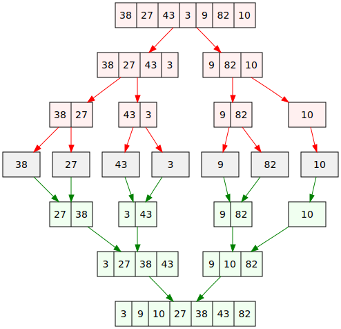

# Zkouška

## Přednáška 1  Časová složitost

### Algoritmus

intuitivní pojem, není pro něj specifikcká definice
možnou definicí by mohlo být
- Konečná posloupnost elementárních příkazů, jejichž provádění
umožňuje pro každá přípustná vstupní data mechanickým způsobem
získat po konečném počtu kroků příslušná výstupní data

Typické vlastnosti:
- konečnost
- hromadnost
- resultativnost
- jednoznačnost
- determinismus

### Největší společný dělitel:

NSD(x,y), od 1 do min(x,y)
- zkoušet od min(x,y) dolů do nalezení prvního společného dělitele
- nalézt prvočíselné rozklady x,y, maximální společná část je pak NSD(x,y
- Euklidův algoritmus:
  - x < y --> NSD(x,y) = NSD(x,y-x)
  - x > y --> NSD(x,y) = NSD(x-y,y)
  - x = y --> NSD(x,y) = x
```python
while y > 0:
  z = x % y
  x = y
  y = z
print(x)
```

### Efektivita algoritmu:

časová - rychlost výpočtu programu

prostorová(paměťová) - paměť potřebná na uložení dat při výpočtu programu

optimalizujeme zpravidla jen jedno, protože obě kritéria mohou mířit proti sobě
"výměna času za paměť"

### Funkce:

počet vykonaných operací v závislosti na velikosti vstupních dat
funkce časové i prostorové složitosti většinou rostoucí

### Asymptotická časová složitost:

Symbol velké O, odhad shora
f, g: N → R
f ∈ O(g) <=> E c > 0 V n0 > 0 V n ≥ n0 : 0 ≤ f(n) ≤ c.g(n)

Opačný odhad zdola: f ∈ Ω(g) 0 ≤ c.g(n) ≤ f(n)

Přesný (těsný) odhad: f ∈ Θ(g) <=> f ∈ O(g) a f ∈ Ω(g)

Typické třídy asymptotické složitosti jsou
- O(1)
- O(log N)
- O(N)
- O(N log N)
- O(N<sup>2</sup>)
- O(N<sup>x</sup>)
- O(2<sup>N</sup>)
- O(N!)

polynomiálně omezený čas zvládnutelný i pro velká n, exponenciální časově nezvládnutelný
## Přednáška 2  Základní algoritmy

### Složitost algoritmu v různých příkladech:

Pro každá vstupní data velikosti N nemusí trvat výpočet stejně dlouho

Časová složitost algoritmu v
- nejhorším případě: maximální počet vykonaných operací
- nejlepším případě: minimální počet vykonaných operací
- průměrném případě: očekávaný počet vykonaných operací

nejčastěji se používá časová složitost v nejhorším případě

v průměrném případě se dobře charakterizuje kvalita algoritmu, ale je obtížně oddůvoditelná

### Složitost problému:

- složitost nejlepšího algoritmu (z hlediska časové složitosti),
kterým lze řešit daný problém

odvození bývá často obtížné, pro řadu problémů je složitost neznámá

Pro dokazování nejhoršího případu potřebujeme
- existuje algoritmus, který vyřeší problém v dané časové složitosti v nejhorším případě, předvedeme konkrétní algoritmus
- každý algoritmus řešící daný problém pracuje v dané časové složitosti v nejhorším příkladě, bývá složité na dokázání

Příklad

Nalézt maximum z N čísel
- existuje algoritmus v čase O(N)
- nemůže existovat algoritmus s lepší časovou obtížností, protože musíme projít všech N čísel

### Základní algoritmy s čísly:

#### Rozklad čísla na cifry
```python
def ciferny_soucet(x):
y = 0
while x != 0:
  y += x % 10
  x //= 10
return y
```
#### Test prvočíselnosti 

- zkusit všechny dělitele od 2 do N-1, cca O(N)
- zkusit všechny dělitele od 2 do $\frac{N}{2}$, cca O(N) ale lepší
- zkusit všechny dělitele od 2 do $\sqrt{N}$, cca O($\sqrt{N}$)
- zkusit dělitele od 2 do $\sqrt{N}$ do nalezení prvního
  - v nejhoším O($\sqrt{N}$)
  - v nejlepším 1
- zkusit 2 a poté liché dělitele lichých čísel
```python
from math import sqrt

def prvocislo(n):
  for d in range(2, int(sqrt(n) + 1):
    if n % d == 0:
      return False
  return True
```
nebo 
```python
def prvocislo(n):
  if n % 2 == 0: 
    return n == 2  #jediné sudé prvočíslo
  d = 3
  while d * d <= n:
      if n % d == 0:
        return False
      d += 2
  return True
```

#### Eratosthenovo síto 

Určete všechna prvočísla od 2 do N

princip - v řadě od 2 do N postupně škrtáme všechny násobky jednotlivých prvočísel, zbývající čísla pak jsou hledaná prvočísla 
```python
def eratosth(n):
  sito = [False, False] + [True] * (n-1)
  prvocisla = []

  for i in range(n + 1):
    if sito[i]:
      prvocisla.append(i)
      j = i * i         #staci zacit s nasobky od kvadratu
      while j <= n:
        sito[j] = False
        j = j + i
  return prvocisla
```
časová složitost je O($\frac{N}{2}$ + $\frac{N}{3}$ + $\frac{N}{5}$ + ...) = O(N log(log N))

#### Dlouhá čísla 

počítání s čísly s desítkami nebo stovkami cifer
python to umí sám

reprezentace
- vytvoříme seznam cifer
- použijeme seznam čísel nikoli znaků
- pořadí cifer zvolíme odpředu nebo odzadu

operace
- po cifrách sčítání, odčítání, násobení, dělení
- počítání modulo 10

desetinné číslo, ukládáme pozici desetinné čárky
- speciální hodnota uložená v seznamu (nešikovné)
- proměnná s indexem nulového řádu
- použít dvě pole (celá a desetinná část)

Příklad

Součet dvou kladných celých čísel s mnoha ciframi
Vstup: a,b jsou seznamy cifer sčítaných čísel, a[0] = cifra v řádu jednotek
Výstup: c je výsledný seznam cifer součtu čísel a + b

- sčítání s přenosem v rozsahu cifer kratšího čísla
- ošetřit přečnívající část delšího čísla
- přidat případný poslední nenulový přenos

při dělání přes spojové listy (LSS) nejsme omezeni počtem cifer, nutno otáčet seznam
```python
if len(a) < len(b)
  a, b = b, a

prenos = 0
c = []
for i in range(len(b)):
  x = a[i] + b[i] + prenos
  c.append(x%10)
  prenos = x // 10

for i in range(len(b), len(a)):
  x = a[i] + prenos
  c.append(x%10)
    prenos = x // 10

if prenos > 0:
  c.append(prenos)
```

#### Vyhodnocení polynomu v bodě 

a(x) = a<sub>n</sub>x<sup>n</sup> + a<sub>n-1</sub>x<sup>n-1</sup> ... + a<sub>1</sub>x + a<sub>0</sub>
- n stupeň polynomu
- a<sub>0</sub>, ...,a<sub>n</sub> koeficienty (reálné konstanty)
- x proměnná, dosazujeme různé hodnoty

Přímý výpočet podle předpisu 

- počet násobení: n + (n-1) + (n-2) + ... + 1 = $\frac{n(n+1)}{2}$
- počet sčítání: n
- časová složitost: Θ(n<sup>2</sup>)

Hornerovo schéma

a(x) = (...((a<sub>n</sub>x + a<sub>n-1</sub>)x + a<sub>n-2</sub>)x + ... + a<sub>1</sub>)x + a<sub>0</sub>
  - počet násobení: n
  - počet sčítání: n
  - časová složitost: Θ(n)
```python
def horner(a, x):
# a: seznam s koeficienty polynomu a[i] * x^i, x: bod z Df, vrátí hodnotu v bodě x
  h = 0
  for i in range(len(a)-1, -1, -1):
    h = h * x + a[i]
  return h
```
Příklady použití jsou vstup čísla po znacích nebo konverze číselného str na int

pomocí LSS, v každém uzlu uložen koeficient a exponent jednoho členu, vyhodné mít ho uspořádaný
#### Operace s polynomy 

a(x) = a<sub>n</sub>x<sup>n</sup> + a<sub>n-1</sub>x<sup>n-1</sup> ... + a<sub>1</sub>x + a<sub>0</sub>

b = b<sub>m</sub>x<sup>m</sup> + b<sub>m-1</sub>x<sup>m-1</sup> ... + b<sub>1</sub>x + b<sub>0</sub>

součet
```python
a = [2, -5, 0, 4, 6]     # 6x^4 + 4x^3 - 5x + 2
b = [11, 0, -2]          # -2^2 + 11

def soucet(a, b):
  c = []
  if len(a) < len(b)
    a, b = b,a
  for i in range(leb(b)):
    c.append(a[i]+b[i])
  for i in range(len(b), len(a)):
    c.append(a[i])
  while len(c) > 1 and c[-1] == 0:
    del[-1]
  return c

print(soucet(a,b))
```
součin
```python
a = [2, -5, 0, 4, 6]     # 6x^4 + 4x^3 - 5x + 2
b = [11, 0, -2]          # -2^2 + 11

def soucin(a, b):
  c = [0] * (len(a) + len(b) - 1)
  for i in range(len(a)):
    for j in range(len(b)):
      c[i+j] += a[i] * b[j]
  return c

print(soucin(a,b))
```
#### Číselné soustavy 

převod z dvojkové soustavy na číselnou hodnotu přes Hornerovo schéma

***110010*** = ***1***.2<sup>5</sup> + ***1***.2<sup>4</sup> + ***0***.2<sup>3</sup> + ***0***.2<sup>2</sup> + ***1***.2<sup>1</sup> + ***0***.2<sup>0</sup> = ((((***1***.2 + ***1***).2 + ***0***).2 + ***0***).2 + ***1***).2 + ***0*** = 50

převod z šestnáctkové soustavy na číselnou hodnotu

A1F = ***A***.16<sup>2</sup> + ***1***.16<sup>1</sup> + ***F***.16<sup>0</sup> = ***10***.16<sup>2</sup> + ***1***.16<sup>1</sup> + ***15***.16<sup>0</sup> = (***10***.16 + ***1***)16 + ***15*** = 2591

Převod binárního zápisu (str) na číselnou hodnotu, O(N)
```python
def bin_int(s):
  n = 0
  for i in range(len(s)):
    n = n * 2 + int(s[i])
  return n
```
Převod hexadecimálního zápisu (str) na číselnou hodnotu, O(N)
```python
def hex_int(s):
  cifry = "0123456789ABCDEF"
  n = 0
  for i in range(len(s)):
    n = n * 16 + cifry.index(s[i])
  return n
```
Pro převod číselné hodnoty do dvojkové soustavy využijeme Hornerovo schéme v opačném směru, posloupnost zbytků při celočíselném dělení dvěma tvoří odzadu dvojkový zápis čísla, O(n)
```python
def int_bin(n):
  if n == 0:
    return "0"
  s = []
  while n > 0:
    s.append.(str(n % 2))
    n //= 2
  return "".join(reversed(s))
```
Převod z číselné hodnoty do hexadecimální soustavy, O(n)
```python
def int_hex(n):
  if n == 0:
    return "0"
  cifry = "0123456789ABCDEF"
  s = []
  while n > 0:
    s.append(cifry[n % 16])
    n //= 16
  return "".join(reverse(s))
```
#### Rychlé umocňování 

Příklad

spočítat hodnotu x<sup>n</sup> 
 - n: velké kladné číslo
 - x: reálné číslo(nebo matice)

přímočaré řešení, Θ(N)
```python
def mocnina1(x, n):
  v = 1
  for i in range(n):
    v *= x
  return v
```
postupně počítáme hodnoty x, x<sup>2</sup>, x<sup>4</sup>... a vhodně z nich vynásobíme

mocninu rozložíme na definitivní rozklad mocnin dvojky, a jsou to ty mocniny dvojky, kde je jednička v binárním zápisu čísla n, Θ(log N)
```python
def mocnina2(x, n):
  v = 1
  while n > 0:
    if n % 2 == 1:
      v *= x
    x = *= x
    n //= 2
  return v
```
## Přednáška 3, Vyhledávání v seznamu

Příklad

kde se nachází daná hodnota x v seznamu pokud v něm je

Základní algoritmus je sekvenční vyhledávání, jeden průchod celým polem, neefektivní, O(N)
```python
j = -1
for i in range(len(s)):
  if a[i] == x:
    j = i
    break
if j == -1:
  print ("není tam")
else:
  print("je na pozici", j)
```
pomocí while cykklu
```python
i = 0
while i < len(a) and s[i] =! x:
  i += 1
if i = len(s):
  print("není tam")
else:
  print("je na pozici", i)
```
binární vyhledávání 

Data musí být uspořádaná, vezmeme prostřední prvek a porovnáme ho s hledaným, dále se dívame jen na menší nebo větší půlku a dostáváme úseky $\frac{n}{2}$, $\frac{n}{4}$, $\frac{n}{8}$...1

časová složitost - $\frac{n}{2^k}$ = 1 --> n = 2<sup>k</sup> --> log<sub>2</sub>(n) = log<sub>2</sub>(2<sup>k</sup>) --> log<sub>2</sub>(n) = k tedy O(log(n))
```python
i = 0    #začátek úseku
j = len(s) - 1    #konec úseku
k = (i + j) // 2    #střed úseku

while a[k] != x and i <= j:
  if x > a[k]:
    i = k + 1
  else:
    j = k - 1
  k = (i + j)//2

if x == a[k]:
  print("je na pozici", k)    
else:
  print("není tam")    #při více vyskytů najde některý z nich
```

### Řazení dat v poli

Úloha uspořádat prvky podle velikosti

Přímé metody, O(n<sup>2</sup>)
- SelectSort: třídění výběrem, přímý výběr
- InsertSort: třídění vkládáním, přímé zatřiďování
- BubbleSort: třídění změnami, bublinkové tříďění

Rychlejší metody, O(n log(n))
- MergeSort: třídění sléváním
- QuickSort: třídění rozdělováním
- HeapSort: třídění haldou

Přihrádkové metody, O lineární, ne nutně k n
- CountSort: třídění počítáním
- BucketSort: přihrádkové třídění
- RadixSort: víceprůchodové přihrádkové třídění

Python sám umí řadit pomocí sorted(), sort()

### Select sort, Θ(n<sup>2</sup>)

pole dělíme na setříděné vlevo a nesetřídené vpravo, vždy najdeme nesetříděný prvek a posuneme ho co nejvíce doleva
```python
def select_sort(s):
  for i in range(len(s) - 1)
    k = i
      for j in range(i + 1, len(s)):
        if s[j] < s[k]:
          k = j
      if k > i:
        s[k], s[i] = s[i], s[k]
```
### Insert sort, Θ(n<sup>2</sup>)

pole rozdělíme na setříděné vlevo a nesetříděné vpravo, na začátku je setříděný první prvek a poté se vždy první z nesetříděného řadí na své místo v setříděném
```python
def insert_sort(s):
  for i in range(1, len(s)):
    x = s[i]
    j = i - 1
    while j >= 0 and x < a[j]:
      a[j+1] = a[j]
      j -= 1
    a[j+1] = x
```
### Bubble sort,  Θ(n<sup>2</sup>)

procházíme polem a porovnáváme sousední prvk, jsou-li špatně vyměníme je
```python
def bubble_sort(s):
  for i in range(len(s)-1):    #počítadlo průchodů
    for j in range(len(s)-i-1):
      if a[j] > a[j+1]:
        a[j], a[j+1] = a[j+1], a[j]
```
### Merge sort, Θ(n log n) 

prostorová složitost Θ(n)

log<sub>2</sub>n kroků výpočtu, v každém z nich se vykoná práce Θ(n)

nejdříve porovnáme dvojice a dostaneme pole uspořádaných dvojic, poté sléváme první a druhou, třetí a čtvrtou, ... dvoji do čtveřice, takto děláme stále větší kusy
```python
def mergesort(s):
  n = len(s)
  temp = [None] * n

  usek = 1
  while usek < n
    for zacatek in range(0, n-usek, 2*usek):
      stred = zacatek + usek - 1
      konec = min(stred + usek. n-1)
      merge(s, zacatek, stred, konec, temp)
    usek *= 2

def merge(s, zac, stred, kon, temp):
  i = zac    #zacatek prvniho useku
  j = stred + 1    #zacatek druheho useku
  k = zac    #zacatek vysledenho seznamu

  while i <= stred and j <= kon:
    if s[i] < s[j]:
      temp[k] = s[i]
      i += 1
    else:
      temp[k] = a[j]
      j += 1
    k += 1

  if i <= stred:    #zbytek prvniho useku
    temp[k:kon+1] = s[i:stred+1]
  else:    #zbytek druheho useku
    temp[k:kon+1] = s[j:kon+1]
  s[zac:kon+1] = temp[zac:kon+1]
```

<p align="center">
  
</p>

### Třídění s lineární složitostí 

Třídíme celá čísla z předem známého rozsahu hodnot velikosti R, D = dolní mez, H = horní mez, R = H - D

rozsah R není velký, vytvoříme v paměti seznam délky R, což je pole indexované od D do H a posouváme indexy o konstantu D

lineární časová složitost

### Count sort, O(n)

třídíme pouze celá čísla

Realizace
- s = původní seznam délky n
- b = setříděný seznam délky n
- c = pomocný seznam celých čísel s indexy D..H

projdeme seznam a, do seznamu c spočítáme váskyty hodnot, projdeme seznam c, z uložených hodnot vytvoříme seznam b v původním poli a 
```python
def count_sort(s, d, h):
  c = [0] * (h-d)

  for x in s:
    c[x-d] += 1

  b = []
  for i in range(h-d):
    for j in range(c[i]):
      b.append(i+d)
  return b
```

## Přednáška 4, Základní datové struktury

### Reprezentace dat v paměti 

- proměnná
- statické a dynamické typování
- hodnotové a referenční typy
- mutable (list, dict...) a imutable (int, tuple...)

### Operace se seznamem 

- insert(index, hodnota)
- remove(hodnota)
- pop(index)
- del(prvek)

časová složitost O(n)

- append(hodnota)
- pop()

na konci seznamu, časová složitost O(1)

### Abstraktní datové typy

Příklad
- zásobník
- fronta
- halda

#### Zásobník (stack)

last in, first out

pamatuje si pořafí, odebíráme nejdříve přidaný prvek, jasně určený spodní, jiný prvek než vrchol je nepřístupný

konstantní časová složitost všech operací 

příklad použití DFS (prohledávání do hloubky)

Implementace 
- zásobník reprezentován seznamem z
- dno z[0]
- vrchol z[-1]
- inicializace z[]
```python
class Zasobnik:
  def __init__(self):
    self.s = []

  def pridej(self, x):
    self.s.append(x)

  def odeber(self):
    return self.s.pop()

z = Zasobnik()

z.pridej(37)
print(z.odeber())
```

#### Fronta (queue)

first in, first out

pamatuje si pořadí, přidává se na konec odebíra ze začátku, přístup k jedninému nejstaršímu prvku

konstantní časová složitost operací 

příklad použití BFS (prohledávání do šířky)

Implementace:
- franta reprezentována seznamem f
- konec fronty f[-1]
- začátek fronty f[0]
- inicializace f[0]

odebírání prvku bude mít takto složitost O(n), funkce deque má složitost konstantí 
```python
from collections import deque
f = deque
f.append(x)
x = f.popleft()
```
#### Halda (heap)

nepamatuje si pořadí příchodu, prvky musí být porovnatelné, odebírá se vždy nejmenší(největší) prvek

typickými operacemi je přidání prvku, určit minimální hodnotu, odebrat minimální prvek

časová složitost O(log n)

představujeme si jako binární strom, implementovaný v poli

příklady použití jsou prioritní fronta (priority queue) nebo HeapSort 

 Reprezentace haldy:

pomocí binárního stromu se zcela zaplněnými hladinami kromě poslední, která je zaplněna souvisle zleva, výška haldy tedy log<sub>2</sub>(n)

uspořádání hodnot otec ≤ syn

Efektivita
- určení minima O(1)
- přidání prvku O(log n)
- odebrání prvku O(log n)

Operace na haldě:

Přidání prvku:

- nový uzel přidat do haldy n poslední hladinu úplně vlevo a přiřadit mu hodnotu
- novou hodnotu opakovaně zaměňovat s hodnotou v otci dokud je třeba 

Odebrání prvku:

- odebrat minimum z kořene haldy
- do kořene vložit hodnotu z posledního uzlu haldy a poslední uzel zrušit
- přesunutou hodnotu zaměňovat s hodnotou v synovi dokud je třeba

Implementace haldy 

seznam ukládaných záznamů

obsah haldy uložen po vrstvách 
```python
halda = [None]    #nepoužijeme index [0]

def pridej(h, x)
  h.append(x)
  j = len(h) - 1
  while j > 1 and h[j] < h[j//2]:
    h[j], h[j//2] = h[j//2], h[j]
    j //= 2

def zrus_min(h):
  if len h == 1:
    return None
  zrus = h[1]
  h[1] = h[-1]
  del h[-1]
  j = 1
  while 2*j < len(h):
    n = 2*j
    if n < len(h)-1:
      if h[n+1] < h[n]:
          n += 1
    if h[j] > h[n]:
      h[j], h[n] = h[n], h[j]
      j = n
    else break
  return zrus
```
Konstrukce haldy v lineárním čase

výchozí rozložení dat představuje binární strom

nejprve postavíme haldy z podstromů, jejiž kořeny mají hloubku d-1, d-2,... záměnami hodnot kořene k listům

důkaz probíhá přes matematickou indukci podle d 

$$
\sum_{j=0}^{d-1} (d - j) \cdot 2^j = \sum_{j=0}^{d-1} d \cdot 2^j - \sum_{j=0}^{d-1} j \cdot 2^j = d \cdot (2^d - 1) - \left((d - 2) \cdot 2^d + 2\right) = O(2^d) = O(N)
$$

$$
\sum_{j=0}^{d-1} 2^j = 2^d - 1
$$

#### Heap sort, O(N log n)

z prvků vytvoříme haldu, O(n log n) nebo zdola O(N)

haldu postupně rozebrat (n-krat odebrat minimum), O(n log n)

celková časová obtížnost tedy bude O(n log n) i v nejhorším případě

#### Prioritní fronta (Priority queue)

podobné jako fronta, prvky se "předbíhají" podle priorit

možnosti implementace
- seznam (pole,LSS) řazený podle priority
- halda podle priority
- halda řazená podle dvojic (priorita, čas příchodu)

## Přednáška 5, spojové seznamy 

### Lineární spojový seznam (LSS)

```python
class Uzel:
  def __init__(self, x = None, dal = None):
    self.info = x    #uložená hodnota
    self.dalsi = dal    #následník

p = Uzel(10)
q = Uzel(20)
r = Uzel(30)
p.dalsi = q
q.dalsi = r

p = Uzel(10, Uzel(20, Uzel(30)))

#průchod a výpis
s = p
while s != None:
  print(s.info, end = " ")
  s = s.dalsi
print()

#posledni uzel
if p == None:
  print("prazdny seznam")
else:
  s = p
  while s.dalsi != None
    s = s.dalsi
  print(s.info)

#vyhledání zadané hodnoty
hodnota = 2O
print("hledame", hodnota)
s = p
while s != None and s.info != hodnota:
  s = s.dalsi
if s == None:
  print("nenalezen")
else:
  print("nalezen", s.info)

#pridani na zacatek
t = Uzel(40)
t.dalsi = p
p = t

#pridani na konec seznamu
if p == None:
  p = Uzel(50)
else:
  s = p
  while s.dalsi != None:
    s = s.dalsi
  s.dalsi = Uzel(50)
```
Operace se spojovým sezname

- určit počet prvků
- vypsat všechny hodnoty
- nalezení posledního prvku
- vyhledání prvku s danou hodnotou
- přidání prvku na začátek/konec
- vytvoření seznamu z dat na vstupu
- vytvoření kopie seznamu
- přidání prvku na místo
- přidání prvku do uspořádaného seznamu
- odebrání prvku ze začátku/konce
- odebrání daného prvku
- zrušení všech prvků v seznamu s danou hodnotou
- obrácení pořadí
- uspořádání pomocí hodnoty
- spojení dvou seznamů do sebe
- slití (merge) dvou uspořádaných seznamů do sebe
- rozdělení do dvou
```python
class Node:
    def __init__(self, value):
        self.value = value
        self.next = None

class Linked_list:
    def __init__(self, value):
        self.head = None
        current = None
        for x in value:
            node = Node(x)
            if not self.head:
                self.head = node
                current = self.head
            else:
                current.next = node
                current = current.next
                
    #převedení LSS do lsitu            
    def to_list(self):
        list = []
        current = self.head
        while current is not None:
            list.append(current.value)
            current = current.next
        return list
    
    #délka LSS
    def len(self):
        c = 0
        current = self.head
        while current is not None:
            c += 1
            current = current.next
        return c
    
    #vrať poslední prvek
    def get_n(self, n):
        current = self.head
        for x in range(n):
            current = current.next
        return current.value
    
    #obsahuje prvek x
    def has_x(self, x):
        current = self.head
        while current is not None:
            if current.value == x:
                return True
            current = current.next
        return False

    #odebrání prvku x 
    def delete_x(self, x):
        current = self.head
        if self.head == x:
            self.head = self.head.next
            return
        while current.next is not None:
            if current.next == x:
                current.next = current.next.next
            current = current.next
        return

    #převrácení LSS
    def rotate(self):
        if self.len() <= 1:
            return
        previous = None
        current = self.head
        while current.next is not None:
            previous = current
            current = current.next
        previous.next = None
        current.next = self.head
        self.head = current
        return
    
    #pomocná funkce na tačínající prvek
    def starts(self, p, q):
        while p is not None and q is not None:
            if p.value != q.value:
                return False
            p = p.next
            q = q.next
        if q is not None:
            return False
        else:
            return True

    #začínají jeden LSS hodnotami v druhém
    def starts_with_m(self, m):
        list1 = self.head
        list2 = m.head
        if self.starts(list1, list2) is True:
            return True
        else:
            return False
    
    #obsahuje jeden LSS prvky druhého ve stejném pořadí 
    def contains_m(self, m):
        current = self.head
        list2 = m.head
        while current is not None:
            if self.starts(current, list2) is True:
                return True
            else:
                current = current.next
        return False

    #LSS konci na posloupnost druheho LSS
    def ends_with_m(self, m):
        len_self = self.len()
        len_m = m.len()
        current = self.head
        list2 = m.head
        difference = len_self - len_m
        if len_self < len_m:
            return False
        for x in range(difference):
            current = current.next
        if self.starts(current, list2) is True:
            return True
        else:
            return False
```
Příklady použití LSS

#### Zásobník 
```python
class Zasobnik

  def __innit__(self):
    self.s = []

  def pridej(self.x):
    self.s.append(x)

  def odeber(x)
    return self.s.pop()
```
#### Fronta 

realizována jednoduchým LSS a dvěma ukazateli na začátek a na konec

na začátku LSS bude odchod a na konci příchod, protože na konci se špatně odebírá

#### Druhy LSS

- obyčejný seznam (doposud)
- obousměrný seznam
- cyklický seznam
- seznam s hlavou

Obousměrný seznam
```python
class Uzel:
  def __init__(self, x = None):
    self.info = x
    self.za = None
    self.pred = none
```
paměťově náročnější než obyčejný, umožňuje procházení seznamem oběma směry

Cyklický seznam

poslední prvek seznamu neodkazuje na None, ale na první prvek

lze použít i v obousměrném pak ukazuje i na prvek .pred

Seznam s hlavou

hlava - jeden prvek navíc umístěný na začátku seznamu, neobsahuje uloženou hodnotu, ale ani není None

## Přednáška 6, Rekurze, binární a obecné stromy

### Rekurze 

Objekt nebo jev je definován pomocí sama sebe

dvě možnosti
- rekurzivní algoritmus: řešení úlohy pomocí řešení menších instancí téhož problému
- rekurzivní volání funkce: fukce volá sama sebe

Příklady

výpis znaků pozpátku
```python
def otoc():
  u = input("znak: ")
  if u != " ":
    otoc()
  print u
# vstup - výstup
A  -  " "
B  -  C
C  -  B
" "  -  A
```
palindrom
```python
def palindrom(s):
  n = len(s)
  for i in range(n//2):
    if s[i] != s[n-i-1]:
      return False
  return True

def palindrom2(s):
  if len(s) <= 1:
    return True
  else:
    return s[0] == s[-1] and palindrom2(s[+:-1])
```
Euklidův algoritmus
```python
def nsd(x,y):
  while x§= y:
    if x > y:
      x -= y
    else:
      y -= x
  return x
```
nebo
```python
def nsd(x, y):
  if y == O:
    return x
  return nsd(y, x % y)
```
faktoriál n
```python
def faktorial(n):
  f = 1
  for i in range(2, n+1)
    f *= i
  return f

def faktorial(n):
  if n == 0:
    return 1
  else:
    return n * faktorial(n-1)
```
Fibonacciho čísla 
```python
def fib(n):
  if n == O or n == 1:
    return n
  else:
    return fib(n-1) + fib(n-2)
```
teoreticky správná rekurze, ale časová složitost je exponenciální, pro n > 40 nepoužitelná, mnohokrát se počítají stejné věci

řešení pomocí dynamického programování nebo meoizace, O(n)
```python
def fib(n):
  if n == 0:
    return 0
  a = 0; b = 1
  while n > 1:
    a,b = b, a+b
    n -= 1
  return b
```
využití umocňování matice, O(log n)

[[0, 1], [1, 1]]^n

### Binární strom
```python
class Vrchol:
def __init__(self, x = None, l = None, r = None):
  self.info = x
  self.levy = l
  self.pravy = r
```
<p align="center">
  
</p>


